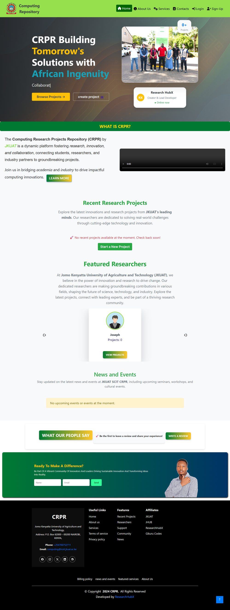
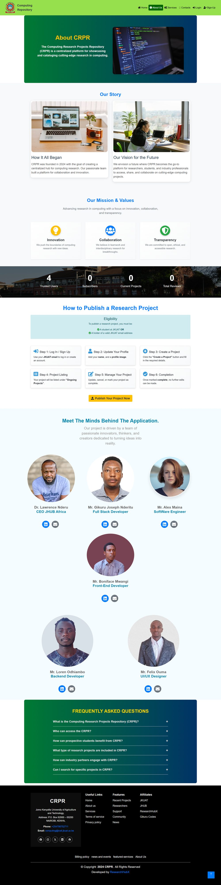
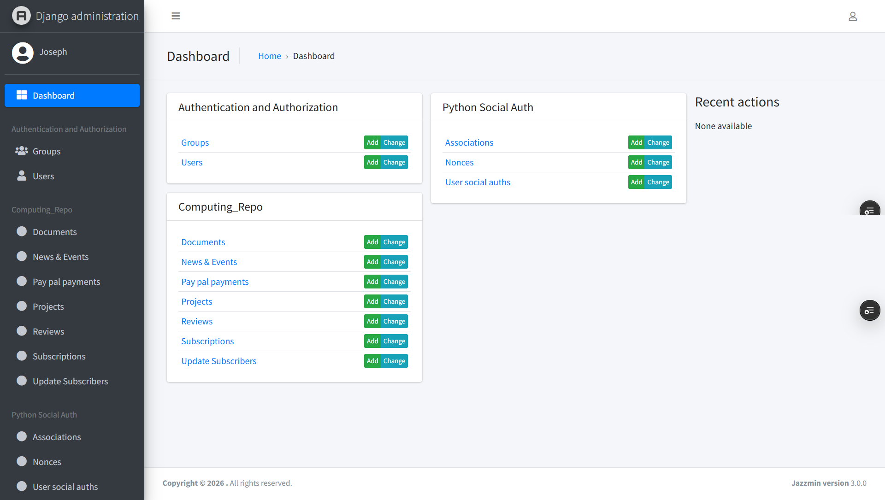

<div align="center">

# CRPR — Computing Research Projects Repository

**A centralized platform for showcasing, cataloguing, and collaborating on computing research at JKUAT.**

[](https://research-hub-x.vercel.app/)
[](https://github.com/JosephNderitu/ResearchHubX)

<br>

[](https://www.python.org/)
[](https://www.djangoproject.com/)
[](https://neon.tech/)
[](https://developer.mozilla.org/en-US/docs/Web/HTML)
[](https://developer.mozilla.org/en-US/docs/Web/CSS)
[](https://developer.mozilla.org/en-US/docs/Web/JavaScript)
[](https://getbootstrap.com/)
[](https://vercel.com/)
[](https://developers.cloudflare.com/r2/)
[](https://developer.paypal.com/)

</div>

---

## Table of Contents

- [Overview](#overview)
- [Live Preview](#live-preview)
- [Key Features](#key-features)
- [Tech Stack](#tech-stack)
- [System Architecture](#system-architecture)
- [Getting Started](#getting-started)
- [Environment Variables](#environment-variables)
- [Deployment](#deployment)
- [Project Structure](#project-structure)
- [Team](#team)
- [Contact](#contact)

---

## Overview

The **Computing Research Projects Repository (CRPR)** is a centralized web platform developed for the **Department of Computing at Jomo Kenyatta University of Agriculture and Technology (JKUAT)**. It addresses a real institutional problem: research project information scattered across disconnected platforms and formats, making it difficult for researchers, students, and stakeholders to discover, track, and collaborate on ongoing work.

CRPR consolidates project cataloguing, researcher profiles, collaboration tools, and discovery features into a single, access-controlled platform, bridging the gap between researchers, students, department administrators, funding bodies, and industry partners.

## Live Preview

| | |
|---|---|
| **Production URL** | [research-hub-x.vercel.app](https://research-hub-x.vercel.app/) |
| **Repository** | [github.com/JosephNderitu/ResearchHubX](https://github.com/JosephNderitu/ResearchHubX) |
| **Admin Panel** | Django Admin, themed with Jazzmin |

<div align="center">

### Homepage



### About Page



### Admin Dashboard



</div>

## Key Features

- **Centralized Research Database** — structured storage for project titles, descriptions, methodologies, collaborators, and outcomes across domains including AI, cybersecurity, software engineering, and data science.
- **Role-Based Access Control** — distinct permission tiers for Admins, Researchers, and Guests, enforcing appropriate visibility and edit rights.
- **Advanced Search & Filtering** — locate projects by keyword, category, tag, or researcher.
- **Researcher Profiles** — personalized dashboards with avatar uploads, project counts, and direct links to a researcher's published work.
- **Project Lifecycle Management** — create, update, mark complete, or cancel a project, with collaborator management and file uploads scoped per project.
- **Social Authentication** — sign-in via GitHub and LinkedIn OAuth, in addition to standard email/password accounts.
- **Subscriptions & Payments** — PayPal-integrated subscription handling for premium account tiers.
- **Reviews & Testimonials** — a public-facing feedback system for platform users.
- **News & Events** — a lightweight CMS module for departmental announcements, seminars, and workshops.

## Tech Stack

| Layer | Technology |
|---|---|
| **Backend Framework** |  Django 5.2 (Python 3.12) |
| **Database** |  Neon (serverless Postgres) |
| **Admin Interface** | Django Jazzmin |
| **Authentication** |   `social-auth-app-django` |
| **Payments** |  PayPal REST SDK |
| **Media Storage** |  S3-compatible object storage |
| **Static Assets** | WhiteNoise with Manifest static file hashing |
| **Frontend** |     |
| **Hosting / Deployment** |  Zero-configuration Django support |
| **Version Control & CI** |   |

## System Architecture

```
┌──────────────────────┐        ┌──────────────────────┐
│      Browser /       │        │   Cloudflare R2       │
│    Client (Bootstrap) │◄──────►│  (Media: avatars,     │
└──────────┬───────────┘        │   review images)       │
           │                     └──────────────────────┘
           ▼
┌──────────────────────┐        ┌──────────────────────┐
│   Vercel Serverless   │◄──────►│   Neon PostgreSQL     │
│   Django Application  │        │   (managed database)  │
└──────────┬───────────┘        └──────────────────────┘
           │
           ▼
┌──────────────────────┐
│   OAuth Providers     │
│  (GitHub, LinkedIn)   │
└──────────────────────┘
           │
           ▼
┌──────────────────────┐
│   PayPal REST API     │
│  (subscriptions)       │
└──────────────────────┘
```

## Getting Started

### Prerequisites

- 
- pip
- 
- A PostgreSQL instance (or use SQLite for local development)

### Local Setup

```bash
# Clone the repository
git clone https://github.com/JosephNderitu/ResearchHubX.git
cd ResearchHubX/CRPR

# Create and activate a virtual environment
python -m venv venv
source venv/bin/activate      # Windows: venv\Scripts\activate

# Install dependencies
pip install -r requirements.txt

# Apply migrations
python manage.py migrate

# Create an admin account
python manage.py createsuperuser

# Run the development server
python manage.py runserver
```

The application will be available at `http://127.0.0.1:8000/`.

## Environment Variables

Create a `.env` file in the `CRPR` directory (never commit this file) with the following keys:

```env
SECRET_KEY=
DEBUG=False
DATABASE_URL=

SOCIAL_AUTH_GITHUB_KEY=
SOCIAL_AUTH_GITHUB_SECRET=
SOCIAL_AUTH_LINKEDIN_OAUTH2_KEY=
SOCIAL_AUTH_LINKEDIN_OAUTH2_SECRET=

PAYPAL_CLIENT_ID=
PAYPAL_CLIENT_SECRET=

R2_ACCESS_KEY_ID=
R2_SECRET_ACCESS_KEY=
R2_BUCKET_NAME=
R2_ENDPOINT_URL=
R2_PUBLIC_URL=
```

## Deployment

CRPR is deployed on **Vercel** using its zero-configuration Django support:

- **Database**: Managed PostgreSQL via [Neon](https://neon.tech/), connected through `DATABASE_URL`.
- **Media Storage**: Since Vercel's serverless functions run on a read-only, ephemeral filesystem, all user-uploaded media (avatars, review images) is offloaded to **Cloudflare R2**, an S3-compatible object store, via `django-storages`.
- **Static Assets**: Collected automatically during Vercel's build step and served through Vercel's CDN.

## Project Structure

```
ResearchHubX/
├── readme-resources/            # README screenshots (homepage.jpg, about.jpg, admin.png)
├── CRPR/                        # Vercel Root Directory
│   ├── CRPR/                    # Django project (settings, urls, wsgi)
│   ├── Computing_Repo/           # Core application (models, views, templates)
│   ├── staticfiles/              # Source static assets (CSS, JS, images)
│   ├── static/                   # collectstatic output (generated, not tracked)
│   ├── media/                    # Local media (development only)
│   ├── manage.py
│   ├── requirements.txt
│   └── vercel.json
└── README.md
```

> `readme-resources/` is kept at the repository root, outside the `CRPR/` Vercel Root Directory, so README images are never pulled into the deployed function bundle.

## Team

| Name | Role |
|---|---|
| Dr. Lawrence Nderu | CEO, JHUB Africa |
| Gikuru Joseph Nderitu | Full Stack Developer |
| Alex Maina | Software Engineer |
| Boniface Mwangi | Front-End Developer |
| Loren Odhiambo | Backend Developer |
| Felix Ouma | UI/UX Designer |

## Contact

**Jomo Kenyatta University of Agriculture and Technology (JKUAT)**
Department of Computing
P.O. Box 62000 – 00200, Nairobi, Kenya

**Email**: [computing@icsit.jkuat.ac.ke](mailto:computing@icsit.jkuat.ac.ke)
**Phone**: 0110423886

For technical inquiries about this repository, reach out via [GitHub Issues](https://github.com/JosephNderitu/ResearchHubX/issues).